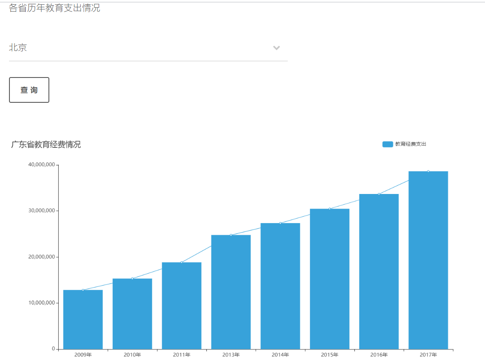
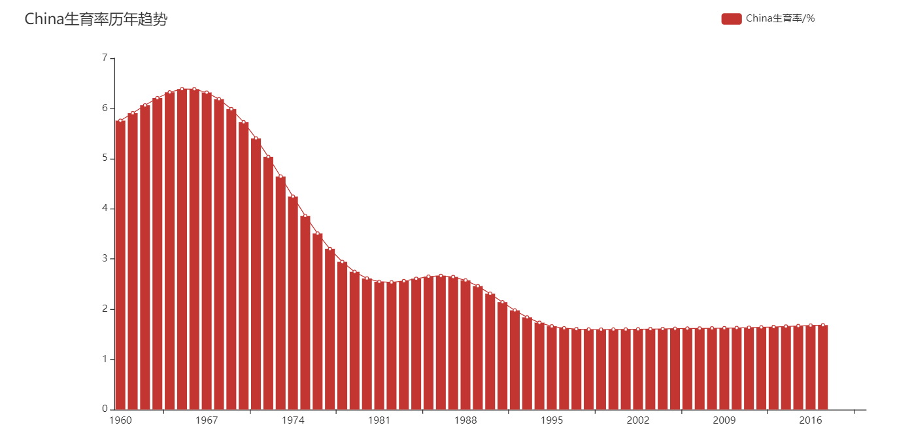

  <h1>交互式可视化数据故事网站搭建</h1>
  
Interactive_Visualization_DataStory_web

> 用于《交互式可视化设计》与《python》实践，自我策展项目

## 项目名称：探讨受教育程度和生育率的关系程度

## 项目目的：
 - 通过分析世界出生率和中国的出生率，再分别分析我国按照年龄的出生率，学龄儿童的入学率和各级普通学校的升学率以及各省教育经费的投入，老探探讨人们受教育程度和生育率的关系。即猜想是否接受的教育车高度越低，生育率就越高？教育程度越落后，生育率就越高？

## 背景和意义：
### 背景：

- 在影响教育不平等的诸多因素中,生育率是一个重要的因素,生育率与教育不平等之间存在相关关系。而女性的受教育程度又会影响个人生育决策:受教育程度越高,生育孩子的数量越少。
- 由此,生育率作为纽带将教育存量与教育分布连接了起来。人口与教育是备受关注的社会问题,研究教育不平等、生育率与女性受教育程度的相互影响关系具有重要的理论和实际意义。

### 意义：

- 探讨受教育程度和生育率的关系程度，根据分析的结果，提出建议更好的建议，提高落后地区的教育经费的投入，加强人们对教育的重视。以此提高整个国家的素质。

## 数据来源：
- 数据收集路径主要有 2 种：
 - 国家统计局
 - 世界银行
 
### 数据故事的选题
- 该故事从我国的社会同点出发，从痛点的根源即出生率着手分析，再分析学龄儿童入学率和各级普通学校升学率和各省的教育经费的投入的差异，进而探讨受教育程度和生育率的关系程度。
- 随着社会的发展，国家对教育越来越重视，但是有一些偏远落后的地区，受教育程度却很低，这也间接导致这些地区的生育率一直居高不下。这也是我国面临的困难之一。应该如何有效妥善的解决是我们共同的探讨。

### 数据的地图可视化和交互功能部分

- 当选择不同的省份，对应的教育经费的可视化是不同的。由各省教育经费的交互图可发现，我国各省的教育经费都是逐年上升，这说明我国越来越注重教育的投入与发展。
- 但是也有一些省份的教育经费的投入是有增有减的，如天津、辽宁等。其中一部分的原因是因为当地的政策所侧重的发展不同，导致经费的投入有所区别。北京、广东等发达的地区，这些省份的教育经费投入是比较大的。

### 数据的非地图可视化和交互功能部分

 
- 当选择不同的国家，对应的可视化图会显示不一样的。当对比之后发现，我国的生育率在世界中并不是很高，甚至有点偏低。这说明我国的出生率咋逐年下降，劳动力人口也逐渐减少。这和我国的政策和社会环境有很大的关系。

### 数据故事的交互设计

- 通过交互探索，我对这个主题有了非常深刻的认识，也能从交互中发掘出大量之前不知道的信息。比如受教育程度和生育率是有一定的关系的。同时发现教育经费的投入和所在地区的发达程度是密切相连的。
